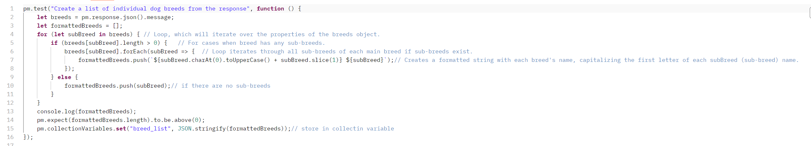
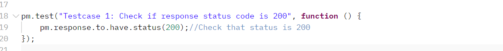

#  QA API Automation Test

##### Done for task `QA UI Automation Test` with 
## Work with site https://dog.ceo/dog-api/  API endpoint https://dog.ceo/api/breeds/list/all
###

###
### 0. Make a request to the endpoint and create a list of individual dog breeds from the response received.
#### line 01-16 

### 0. Make a request to the endpoint and create a list of individual dog breeds from the response received.
#### line 01-16

####
### 1. Test for status code validation 
#### line 18-20 

#### 
### 2. Schema validation
#### line 22-51

####
### 3. Data validation test №1 
####  Check if breeds not contain duplicates
#### line 53-58

####
### 4. Data validation test №2
###  Response should contain expected parent breeds
#### line 60-68

####
### 5. Data validation test №3 - EXTRA TEST
###  Response should contain expected parent breeds
#### line 70-82

#### 
### Test run
####

####  
### I ❤️ 

